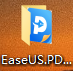
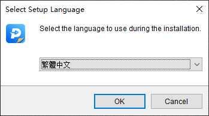
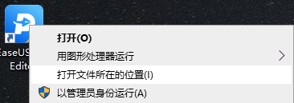
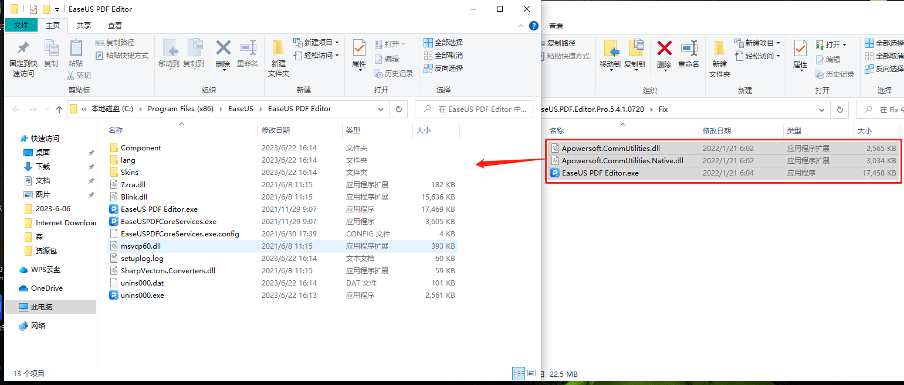
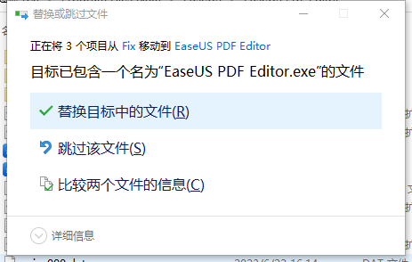
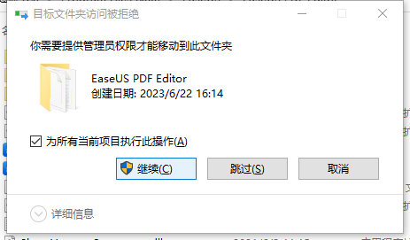

time: 2023.6.22
tag: 软件
title: EaseUS——免费的PDF编辑工具（pro解锁）

#前言#  
WPS Office的pdf编辑功能过于坑爹，下面于是我找到了一款更好的pdf编辑器，除了只有繁体中文外几乎没有缺点

相较于WPS Office，EaseUS PDF 在以下几个方面具有优势：

  1. **专注于PDF编辑** ：EaseUS PDF 是一款专注于PDF文件处理和编辑的软件，而WPS Office是一套综合办公套件，包括文档、表格和演示等多种功能。因此，EaseUS PDF在PDF编辑方面提供了更专业和专注的工具和功能。

  2. **更强大的PDF编辑功能** ：EaseUS PDF 提供了全面而强大的PDF编辑功能，如直接修改PDF文件内容、修复损坏的PDF文件、添加注释和批注、保护和加密文件等。相比之下，WPS Office的PDF编辑功能相对有限，主要注重于文档的查看和基础编辑。

  3. **免费使用的PDF编辑** ：EaseUS PDF 提供免费使用的完整PDF编辑功能，无需支付额外费用。而WPS Office的PDF编辑功能需要用户购买付费版本才能享受完整的编辑功能。这使得EaseUS PDF成为一个更加经济实惠和优惠的选择，特别是对于那些不愿意或不需要额外花费金钱购买软件的用户来说。

  4. **直观友好的用户界面** ：EaseUS PDF 设计了一个直观友好的用户界面，使得用户能够轻松上手并快速完成操作。相比之下，WPS Office在整体界面和操作上更加繁琐复杂，需要一定的时间来适应和掌握。

#安装说明（含解锁pro版）

  1. **下载文件并解压**  
[下载链接](<http://yhsome.github.io/image/2023-6-22/EaseUS.PDF.rar>)  
解压后你会看到一个这样的文件  

  2. **打开Setup.exe进行安装**  
安装时记得选繁体中文  

  3. **打开安装文件夹**  
这里有一个简便的方法，右键桌面上的快捷方式即可打开文件目录  
  
如果你是无脑右键安装，亦可以打开以下路径  
`C:\Program Files (x86)\EaseUS\EaseUS PDF Editor\EaseUS PDF Editor.exe`
  4. **将下载解压目录中的“fix”文件夹中的全部文件复制到安装文件夹中**  
  
记得选择替换目标中的文件  
  
如果出现访问被拒，请以管理员身份运行  

  5. **安装完毕，请愉快使用**
