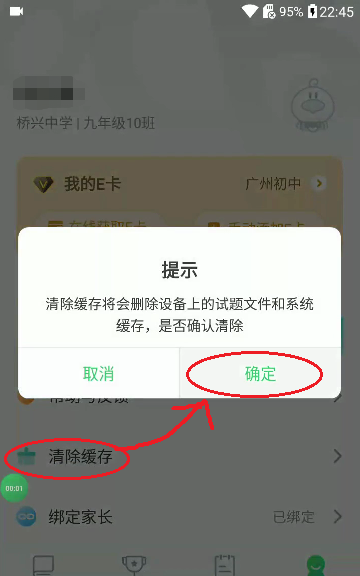
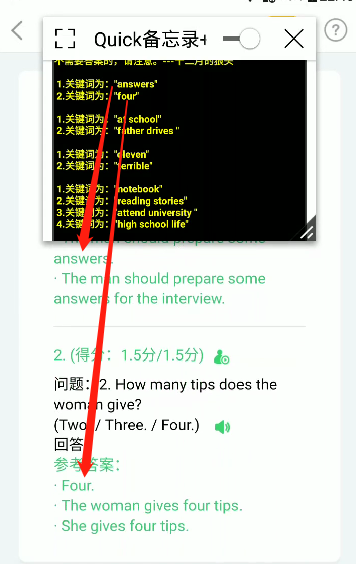

time: 2023.4.21
tag: 学习, 项目
title: E听说辅助工具及使用方法

# 前言

  1. 呃啊…距离上次用E听说做英语都快是一年前的事情了，现在才有机会以网页的形式呈现教程，如果当年有这么干的想法的话，这玩意估计就以及传遍全年级了。
  2. 本软件于2023/4/22 0:17:42测试可用。
  3. 注意，本软件（指E听说极速版，下同）仅限于安卓或兼容安卓的设备使用，**苹果系统不可用** 。

* * *

# 软件介绍

《E听说极速版》是一款十分强大的辅助工具，它不仅**能够帮助您获取最新的听说答案** ，还能够让您在做限时练习时能够**实时看到自己的得分情况** 。这是一款经过一年完善及发展的安卓软件，已稳定运行一年半。拥有独一无二的功能及稳定性。

* * *

# 正文：使用方式

## 安装至您的安卓（或鸿蒙）系统的设备中

  1. 方式一：[点击此打开下载链接](<https://wwqk.lanzoum.com/b030rhwni>) 文件密码:0000
  2. 方式二：扫描二维码下载(密码0000) 

> 

## 快速开始

  1. 获取答案之前，您需要先将e听说的缓存清空，这里提供了两种方法
     1. 使用本软件自带的清除缓存功能（位于发现-清除缓存）
     2. 使用E听说自带的清除缓存功能（位于我-清除缓存），如图：

> 

  2. 点击打开你需要查看的作业（模仿朗读，趣味配音无答案）这里以下图为例： 

> 

  3. **请确保进入如下界面再继续操作** ： 

> 

  4. 直接回到桌面，打开本软件，点击“一键搜索答案” 按钮（不同版本间可能存在差异）

> 

  5. 此时关键词已经出现，组句回答即可 

> 

  6. 也可以使用悬浮窗或分屏便于观看

> 

## 设置界面介绍

  * 文本颜色：点击“一键搜索答案”后文本的字体颜色及背景颜色
  * 显示实时分数：当您再做题时，本软件将检测您实时的分数并**通过消息栏提醒您** ，无需在您完成后才能看到分数。
  * 限制筛选数量：**（不建议打开）** 防止出现过多无效提示
  * 点击“复制开发者QQ号”后，将会启用开发者设置。但是**如果一切正常，并不推荐修改任何关于开发者设置的内容**

## 常见问题解答

  1. Q：为什么极少数情况下答案的顺序会混乱？  
A：这是因为文件的存储方式问题，您可以凭借自身调整回答，这个问题是无法解决的。
  2. Q：为什么本软件会要求联网？  
A：连接网络可以检测版本更新从而提供更好的服务，因此您应该随时打开本软件以确认您所处于的是最新版本。
  3. Q：为什么我的手机不可以查到答案，而其他手机可以？  
A：由于缺乏足够的能力，在众多用户中，目前仅发现一例根据教程而没有出现答案的案例。将来有能力的话会持续深入了解其产生的原因。

* * *

# 后记

首先感谢我自己一个人开发了此软件（划）  
其次向所有参加早期参与体验的人员表达由衷的感谢，感谢你们对我的帮助和建议。  
早期测试人员致谢：逸哥，熙熙，星宇，小明，天天，茂茂，以及所有我校2019届10班的同学们
