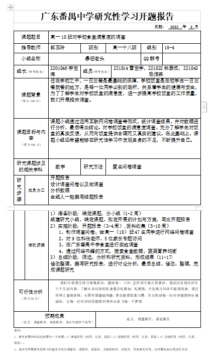
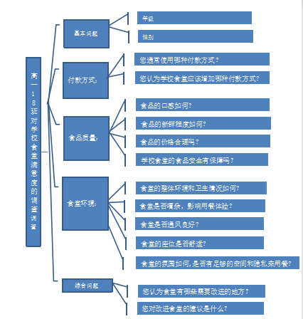
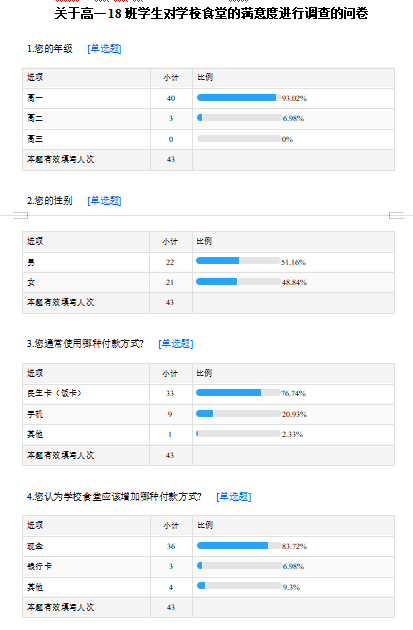
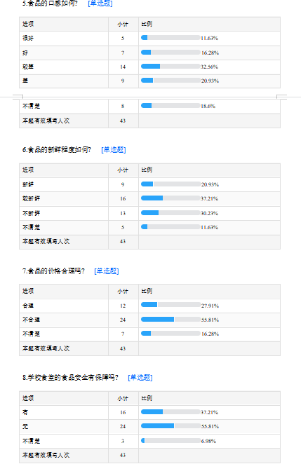
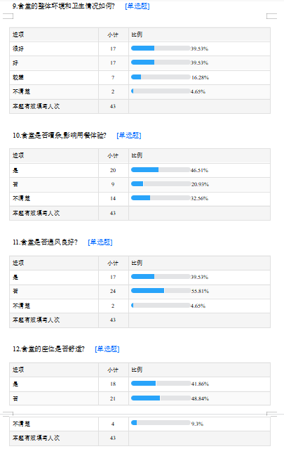
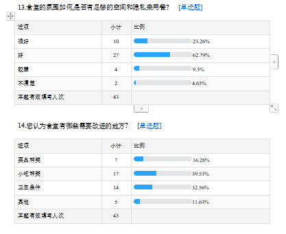

time: 2023.6.2
tag: 学习
title: 综合实践课结题报告

以下内容仅供展示，docx文件转换为markdown格式可能回出现一些格式问题。因此文中的表格会有些异常  
[点此下载docx文件](<https://yhsome.github.io/image/2023-6-03/18-4-jietibaogao2305.docx>)

**高一18班学生对学校食堂的满意度进行调查**

广东番禺中学

研究小组成员：杨浩森，雷世学，林泰成,李世海

指导教师：郭玉玲

**第一部分：课题说明**

  1. 研究背景与意义

研究背景：

学校食堂作为学校日常生活中不可或缺的一部分，直接关系到学生们的身体健康和学习生活。然而，随着学校规模的不断扩大，食堂的管理和服务质量也面临着越来越多的挑战。因此，了解学生对学校食堂的满意度和不满意的原因，对于食堂的改进和提高服务质量具有重要意义。

研究意义：

通过对高一18班学生对学校食堂的满意度进行调查，可以了解他们对食堂的看法和建议，从而为改善学校食堂的管理和服务质量提供参考。同时，研究结果也可以为其他学校的食堂管理提供参考，提高全国学生的饮食环境和健康水平。此外，通过此项调查，也可以加强学生与学校之间的沟通和联系，促进学校与学生之间的良好关系。

  2. 目标

    
    
    1  
    

| 
    
    
    <!-- -->  
      
  
---|---  
  
  1. 价值体认

调查高一18班学生对学校食堂满意度的活动，有助于促进学校与学生之间的沟通和联系，提高食堂的管理和服务质量，以改善全体师生的饮食环境和健康。此外，学生还可以在调查中加强对中国共产党和社会规则的认知，以及个人职业规划和价值观念的培养，为未来的发展做好准备。这样的调查不仅有利于食堂的改进，还有助于培养具有责任感和担当精神的青年一代，为社会的进步和发展做出积极的贡献。

  2. 责任担当

高一18班的学生们对学校食堂满意度的调查充满了责任和担当的社会实践活动。通过这次调查，他们不仅是被调查对象，更是主动参与者和负责人，自发组织和分配任务，深入了解学校食堂现状，收集学生意见和建议，并把结果呈现给学校管理部门。此外，学生们还提高了自己的社会服务能力，并加强了对社会责任意识和法治观念的认知，主动参与志愿者和公益活动，培养了领导、沟通和问题解决能力。总之，这次调查反映了学生的责任担当精神和社会服务能力，同时也为学校和社区提供了有价值的信息和建议，促进了学校和社会的发展和进步。

  3. 问题解决

高一18班对学校食堂满意度调查时，需要明确调查目的和问题指标，制定科学合理的调查方案，进行数据分析和解读，并提出实际可行的解决方案，同时保证解决方案的可持续性。

  4. 创意物化

为了解决学生对学校食堂环境、菜品种类和质量方面的不满意，可以设计新的餐具和餐桌提高用餐体验，或者让学生自己制作简单的菜品增加多样性。这些方案不仅能解决问题，还有助于促进学生的创意设计、动手操作、技术应用和物化能力等综合素质发展。

  3. 开展方式

为了更好地进行高一18班对学校食堂满意度的调查，我们可以采用以下方式开展：

1.  
设计问卷调查：设计一份问卷调查，包括对学校食堂的菜品种类、口味、价格、环境卫生等方面进行评价。可以采用多选、单选和填空等方式，以便学生们更准确地表达自己的意见。

2.  
分组讨论：将学生们分成小组，让每个小组就某个方面展开讨论，如菜品种类、价格等，以便深入了解学生们的需求和意见。

3.  
食堂参观：组织学生们参观学校食堂，让学生们直接感受食堂的环境、卫生情况，以及菜品的制作过程，进一步了解学生们的需求和意见。

4.  
调查分析：通过对问卷、讨论和参观等方式收集到的信息进行分析，总结出学生们对学校食堂满意度的高低点，为学校改进食堂服务提供有针对性的建议和意见。

通过以上开展方式，能够让学生们更全面、更深入地了解学校食堂的情况，从而提出更有价值的建议和意见，为改进学校食堂服务贡献自己的力量。

**第二部分：课题结题报告**

  1. 研究背景

住在学校之中，一日三餐是最基础的保障，学校饭堂是在校学生一日三餐就餐的地方，是每一位同学必到的场所，关系着学生的健康与安全，为了了解学生对学校饭堂的满意度，进一步提高学校饭堂的工作质量，我们开展相关调查。

  2. 研究目的和意义

课题小组通过运用互联网问卷调查等形式，统计调查结果，并对数据进行分析，最后得出结论。对学校饭堂的满意度调查，充分了解学生对饭堂的真实反馈，从而向饭堂提供合理而又真实的建议。在此基础上，课题小组还希望能够在研究性学习中发现自身的不足，不断提升自己。

  3. 研究内容和研究方法

    
    
    1  
    

| 
    
    
    <!-- -->  
      
  
---|---  
  
  1. 研究内容

课题小组通过运用互联网问卷调查等形式，统计调查结果，并对数据进行分析，最后得出结论。对学校饭堂的满意度调查，充分了解学生对饭堂的真实反馈，从而向饭堂提供合理而又真实的建议。在此基础上，课题小组还希望能够在研究性学习中发现自身的不足，不断提升自己。

  2. 研究方法

1.调查法：组建研究小组，确定课题，拟定开展的计划与方案，写出开题报告

2.文献法：通过网络书籍的方式，搜索食堂数据，蔬菜营养均衡

  4. 研究过程

（一）准备阶段

    
    
    1  
    

| 
    
    
    <!-- -->  
      
  
---|---  
  
  1. 确定研究主题：通过班会议讨论和投票，确定研究主题为”高一18班对学校食堂满意度的调查”。

  2. 制定研究计划：根据研究主题，制定了详细的研究计划，包括研究目的、研究方法、研究工具、样本选择等。

（二）实施阶段

    
    
    1  
    

| 
    
    
    <!-- -->  
      
  
---|---  
  
  1. 采取问卷调查法：为了收集班级成员对学校食堂满意度的看法，我们采用问卷调查的方法。通过班会议讨论，设计了一份包括多个方面的调查问卷。

  2. 发放问卷：我们通过班级群、纸质发放等方式，向班级成员发放了调查问卷，并告知调查的目的和重要性。我们要求班级成员在有空的时间内认真填写问卷，并保证对调查内容的保密性。

  3. 收集和整理数据：在规定的时间内，我们收集了班级成员的问卷，并对数据进行了整理和统计。通过数据分析，得出了学校食堂的满意度指数和各方面的评价结果。

（三）总结阶段

    
    
    1  
    

| 
    
    
    <!-- -->  
      
  
---|---  
  
  1. 分析研究结果：通过数据分析和统计，我们得出了学校食堂的满意度指数和各方面的评价结果。我们分析了调查结果，发现学校食堂在一些方面需要改进。

  2. 提出改进建议：基于调查结果和分析，我们提出了学校食堂改进的建议，包括菜品种类、食品质量、服务质量等方面的改进措施。

  3. 撰写调查报告：最后，我们根据研究过程和结果，撰写了一份调查报告，详细介绍了调查的目的、方法、结果和改进建议。同时，我们还将调查结果和建议提交给了学校有关部门，以便学校进一步改进学校食堂的服务质量。

    
    
    1  
    

| 
    
    
    <!-- -->  
      
  
---|---  
  
  5. 研究结果及结论

（一）研究结果：

经过对高一18班学生对学校食堂满意度的调查，我们获得了以下结果：

1.绝大多数学生认为学校食堂的环境卫生较好，食品安全问题较少，但仍有部分学生认为有待改善；

2.学生们对学校食堂的菜品种类和味道普遍不满意，建议增加菜品种类和改进味道；

3.大部分学生对学校食堂的服务态度表示满意，但也有个别学生认为需要改进服务质量。

（二）研究结论：

通过对高一18班学生对学校食堂满意度的调查，我们可以得出以下结论：

1.学校食堂的环境卫生需要保持和改善；

2.学校食堂需要增加菜品种类和改进味道，以满足学生的需求；

3.学校食堂的服务态度需要继续保持和提高，以提升学生的满意度。

  6. 交流评价

（一）学生体会：

通过这次学校食堂满意度的调查，我们收获了很多。首先，我们学会了如何设计调查问卷、如何进行数据分析和结果展示；其次，我们对学校食堂的管理和服务有了更深入的了解，也发现了其中存在的问题和不足；最重要的是，我们意识到了作为学生，我们应该积极参与学校事务，为改善学校环境和服务质量出一份力。

（二）致谢：

在此，我们要向所有参与这次调查的同学表示感谢，感谢你们的积极配合和参与。同时，也要感谢学校提供的资源和支持，让我们得以顺利完成这次调查。最后，我们还要特别感谢我们的指导教师，他们给予了我们无私的帮助和指导，让我们从中学到了很多。

（三）指导教师评价：

我非常欣赏在这次学校食堂满意度调查中所展现的团队合作精神和扎实的工作态度。他们认真分工、积极沟通，通过有效的调查问卷和数据分析，得出了有价值的研究结果。我相信，在这个过程中，他们不仅增强了自己的实践能力和创新意识，也为学校提供了宝贵的参考意见。我希望他们能够继续保持这种积极向上的态度，为自己的成长和学校的发展做出更大的贡献。

**第三部分：研究论文**

**高一18班对学校食堂满意度的调查**

广东番禺中学

研究小组成员：杨浩森，李世海，雷世学，林泰成

指导教师：郭玉玲

**摘要：** 课题小组通过运用互联网问卷调查等形式，统计调查结果，并对数据进行分析，最后得出结论。对学校饭堂的满意度调查，充分了解学生对饭堂的真实反馈，从而向饭堂提供合理而又真实的建议。在此基础上，课题小组还希望能够在研究性学习中发现自身的不足，不断提升自己。

**关键词：** 学校食堂; 满意度调查; 学生评价; 购买习惯; 改进建议

  1. 引言

学校食堂作为学校日常生活中不可或缺的一部分，直接关系到学生们的身体健康和学习生活。然而，随着学校规模的不断扩大，食堂的管理和服务质量也面临着越来越多的挑战。因此，了解学生对学校食堂的满意度和不满意的原因，对于食堂的改进和提高服务质量具有重要意义。

  1. 研究的目的与意义

研究背景：

学校食堂作为学校日常生活中不可或缺的一部分，直接关系到学生们的身体健康和学习生活。然而，随着学校规模的不断扩大，食堂的管理和服务质量也面临着越来越多的挑战。因此，了解学生对学校食堂的满意度和不满意的原因，对于食堂的改进和提高服务质量具有重要意义。

研究意义：

通过对高一18班学生对学校食堂的满意度进行调查，可以了解他们对食堂的看法和建议，从而为改善学校食堂的管理和服务质量提供参考。同时，研究结果也可以为其他学校的食堂管理提供参考，提高全国学生的饮食环境和健康水平。此外，通过此项调查，也可以加强学生与学校之间的沟通和联系，促进学校与学生之间的良好关系。

  2. 研究的对象与方法

课题小组通过运用互联网问卷调查等形式，统计调查结果，并对数据进行分析，最后得出结论。对学校饭堂的满意度调查，充分了解学生对饭堂的真实反馈，从而向饭堂提供合理而又真实的建议。在此基础上，课题小组还希望能够在研究性学习中发现自身的不足，不断提升自己。

研究内容

课题小组通过运用互联网问卷调查等形式，统计调查结果，并对数据进行分析，最后得出结论。对学校饭堂的满意度调查，充分了解学生对饭堂的真实反馈，从而向饭堂提供合理而又真实的建议。在此基础上，课题小组还希望能够在研究性学习中发现自身的不足，不断提升自己。

研究方法

  * 调查法：准备阶段：确定课题，分小组（1-2周）

    * 组建研究小组，确定课题，拟定开展的计划与方案，写出开题报告
  * 实施阶段：开题报告（3-4周）,资料收集（5-10周）

    * 制作调查问卷，给高一（18）班47名同学进行网络问卷调查

    * 对9位科任老师、5位家长专题访问

    * 在广东番禺中学食堂进行实地调查

    * 文献法：通过网络书籍的方式，搜索食堂数据，蔬菜营养均衡

    
    
    1  
    

| 
    
    
    <!-- -->  
      
  
---|---  
  
  * 三、总结阶段：筛选、分析和研究资料，形成结果（11-17)

    * 修改整理，撰写研究报告，进行讨论分析，最后总结、修改、整理，完成课题研究

二、调查结果与分析

1\. 付款方式

> 我们进行了一项关于学生食堂付款方式的调查，共收集到了43份有效问卷。在第一个问题——“您通常使用哪种付款方式？”中，结果显示，民生卡（饭卡）是最受欢迎的付款方式，共有33人选择，比例为76.74%；其次是手机支付，仅有9人选择，占比20.93%；只有1人选择了其他方式，仅占2.33%。可以看到，民生卡作为校园生活常用的卡种，在学生中得到了广泛的认可和使用。
> 
> 在第二个问题——“您认为学校食堂应该增加哪种付款方式？”中，我们得到了如下的反馈：36位受访者认为应当增加现金付款方式，占比83.72%；3位受访者提出应该增设银行卡付款方式，仅占6.98%，其他付款方式也不被广泛支持，只有4位受访者选择，占比9.3%。这说明尽管移动支付越来越普及，但现金仍然是消费者最怀念的”老朋友”，在校园食堂中依然具有重要地位。
> 
> 我们进一步分析发现，导致民生卡成为首选付款方式的原因可能包括以下几点：首先，民生卡在校园环境中具有广泛的应用场景，不仅可以在食堂等消费场所使用，还可以在图书馆、洗衣房等其他地方进行支付。其次，饭卡可以充值，在充值过程中，学生可以享受一定优惠，吸引了更多的消费者使用。此外，支付过程简便，满足快捷、便利的消费需求，广受好评。
> 
> 另一方面，虽然移动支付已经成为人们生活中不可或缺的支付方式，但是并没有完全取代现金支付。在校园中，现金仍然是许多学生首选的支付方式，除了方便快捷之外，还具有一定的安全性和便携性。特别是在食堂等实体场所，对于一些不熟悉手机支付或电子支付的老年人及外来人员来说，现金支付也可能是唯一可行的支付方式。
> 
> 综上所述，学校食堂应在提供电子支付的基础上，增加更多的现金支付窗口或自助设备，满足不同消费者的支付需求。同时，为了鼓励消费者使用更为便捷的支付方式，也可以提供相应的折扣或优惠政策，倡导更便于管理、高效的无现金支付方式。

2.食品质量

根据我们的调查结果显示，针对食品口感这一问题，其中32.56%的人认为较差，20.93%的人认为差，11.63%的人认为很好，16.28%的人认为好，而18.6%的人则不清楚。可以看出口感方面还有一些问题需要改进。

在新鲜程度方面，有20.93%的人认为食品很新鲜，37.21%的人认为较新鲜，30.23%的人认为不新鲜，还有11.63%的人不清楚。这表明学校食堂的新鲜程度需要进一步提高。

另外，考虑到学生们在买食品时会考虑价格因素，我们也对食品价格合理性进行了调查。结果显示，只有27.91%的人认为食品价格合理，而55.81%的人认为不合理，另外还有16.28%的人不确定。这说明学校需要进一步调整食品价格，以符合学生们的需求和预算。

最后，关于学校食堂的食品安全保障，37.21%的人认为有保障，55.81%的人认为没有保障，还有6.98%的人无法确定。这表明学校需要加强食品安全保障管理，为师生们提供更可靠的食品。

3.食堂环境

我们对学生们对食堂环境的看法进行了调查。其中，针对食堂座位的舒适度问题，有41.86%的人认为座位舒适，48.84%的人认为不舒适，还有9.3%的人不清楚。可以看出座位的舒适度需要进一步关注。

在食堂氛围和用餐空间方面，有23.26%的人认为氛围很好，62.79%的人认为好，9.3%的人认为较差，而4.65%的人无法确定。这表明学校的食堂氛围和用餐空间相对较好，但仍有一些改进的空间。

最后，我们询问了学生们对食堂需要改进的地方有哪些看法。结果显示，39.53%的人认为小吃种类需要改进，32.56%的人关注卫生条件，16.28%的人认为菜品种类需要提高，另有11.63%的人选择其他需求。这表明学生们关注食品种类和卫生条件等方面的问题，学校可以针对这些需求进行改进，以提高对学生们的吸引力。

三、结论与建议

经过我们对学生食堂的付款方式、食品质量和食堂环境进行了调查，得出了一些结论和建议。

首先，民生卡是学生们最常用的付款方式，因为它方便快捷并且具有一定的优惠政策。但是，我们也注意到现金支付仍然是许多人的首选支付方式，因为它安全便携。因此，学校应该在提供电子支付的同时增加更多的现金支付窗口或自助设备，以满足不同消费者的支付需求，并提供相应的折扣或优惠政策，鼓励消费者使用更便捷的支付方式。

其次，针对食品质量问题，我们发现口感和新鲜程度还有待进一步改进，并且价格也需要调整以符合学生们的预算。同时，学校应该加强对食品安全的管理，提供更可靠的食品。

最后，在食堂环境方面，学生们普遍认为座位不够舒适，虽然食堂氛围和用餐空间相对较好，但仍有改进的空间。学校应该关注学生们在小吃种类、卫生条件等方面的需求，并针对这些需求进行改进。

综上所述，学校应该全面关注学生食堂的付款方式、食品质量和食堂环境等问题，并积极采取措施加以改进，以提高学生们的用餐体验和满意度。

【**参考文献** 】

[1]978-7-5361-5299-1，《综合实践活动（必修)研究性学习》[S]。 广东省：广东高等教育出版社，2022。

[2] 王志勇. 高校学生饮食消费的调查与分析[J]. 食品工业, 2020,  
41(05):231-232.

[3] 杨丽君. 高校餐饮管理的现状分析及对策[J]. 小吃技术与创新, 2021,  
19(14):81-82.

[4] 邵明利, 马莉. 学生食堂营养餐的调查与研究[J]. 食品研究与开发,  
2022, 43(05):152-153.

[5] 王宁. 大学食堂服务质量满意度调查分析[J]. 经济管理, 2022,  
44(04):204-205.

[6] 张丹丹, 林静婷. 大学生食堂就餐意愿调查及分析[J]. 食品科技, 2020,  
45(06):206-207。

附件1：开题报告

备注：

1.  
研究步骤中的活动步骤分三个步骤：1）准备阶段（时间、任务、目标）2）实施阶段（时间、任务、目标）3）总结阶段（时间、任务、目标）；

2、高中生开展研究性学习的基本方法有调查法、观察法、实验法、文献资料法、比较法、历史研究法等，有时要综合运用这些方法。

附件2：思维导图

4：调查结果

链接：<https://www.wjx.cn/report/223806634.aspx>

**关于高一18班学生对学校食堂的满意度进行调查的问卷**  
  
  
  

