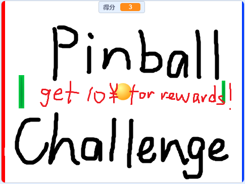
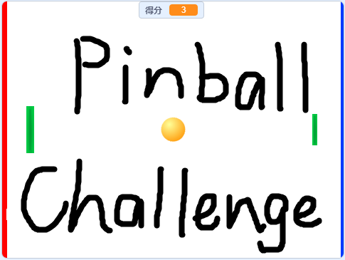
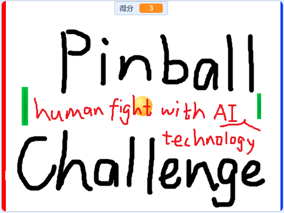

time: 2023.9.1
title: 弹球挑战

# 弹球挑战

这里是弹球挑战，只需30得分即挑战成功！

然而，难度将会越来越大。

祝君好运！

# 挑战成功有奖励！

只要你使用Windows系统在挑战中得到了30分，并且给予我全程（从打开网页开始算起）的挑战录像即为挑战成功，截图发给我，我会给予第一位挑战成功并符合要求的玩家10元红包奖励！

### 挑战链接

[点击此处打开](<https://yhsome.github.io/PinballChallenge/>)

### 详细挑战要求

  * _您需要在挑战录像中明确展示您所打开的网页地址为`https://yhsome.github.io/PinballChallenge/`_
  * _您需要在挑战过程中保证系统流畅（大于30帧）_
  * _您需要使用Windows系统参加挑战_
  * _您需要证明此挑战是由您本人所操作_
  * _**只有满足以上条件并将录像发送给我，经由我本人审核通过后方才能得到奖励**_
  * _最终解释权归我所有_

# 作者的话

这是我第无数次用scratch做游戏了，不过把游戏部署到网页上还是第一次  
下面是一些奇怪的logo设计  
  
  

# 相关信息

开发工具：TurboWarp(scratch)

开发语言：html
