time: 2023.8.8
title: Bandizip专业版解锁及去除更新

### 前言

对于电脑使用者来说，压缩/解压缩软件是必不可少的，今天给大家推荐的Bandizip是一款免费优秀的文件压缩/解压缩软件，界面简洁，功能明了，免费纯净无广告。它支持多国语言，解压后不会出现乱码，Bandizip拥有非常快速的压缩和解压缩的算法，适用于多核心压缩、快速拖拽、高速压缩等功能。

### 解锁步骤

  1. **下载文件**  
[点击下载](<../images/posts/2023-8-08/bandizip7.06.zip>)  
然后你会得到这么一个文件，把它解压  
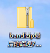
  2. **安装Bandizip**  
运行exe文件进行安装  
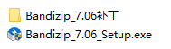  
在安装时，不要点击‘立即下载新版本’，否则新版无法解锁专业版，如图  
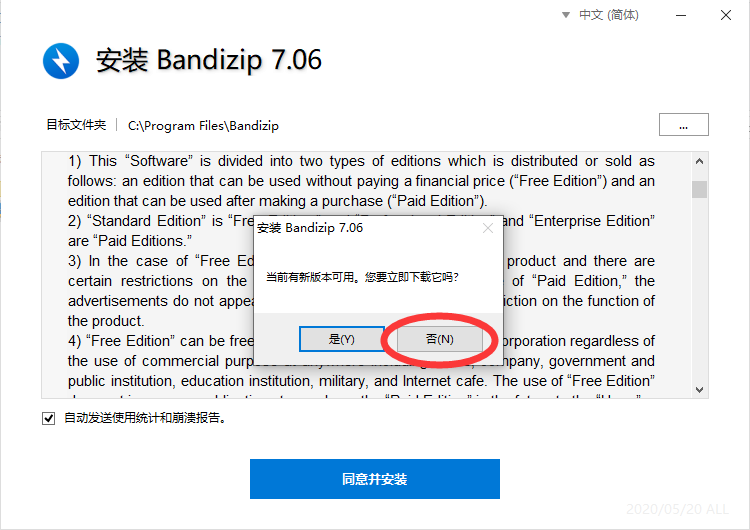
  3. **运行激活程序**  
打开Bandizip安装目录，可根据桌面快捷方式找到安装目录  
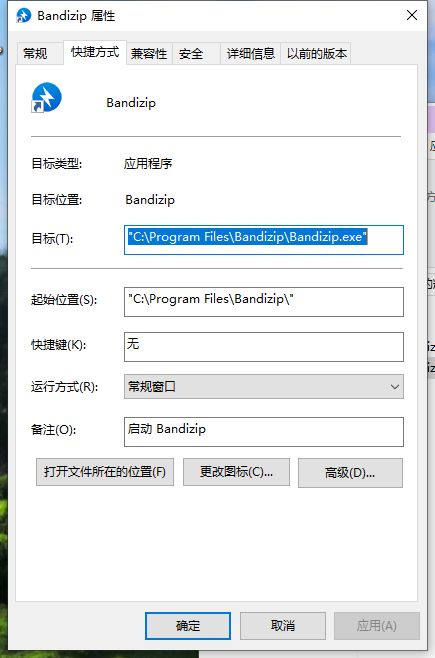  
接着，把激活程序拖入其中  
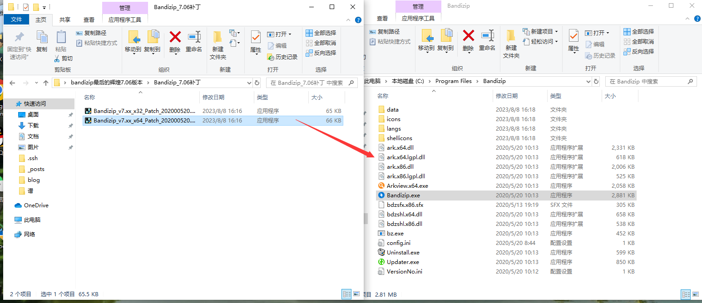  
如果遇到如下情况，点击‘继续’  
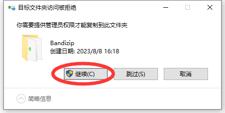  
运行，得到如下信息。复制‘专业版离线密钥’后点击应用  
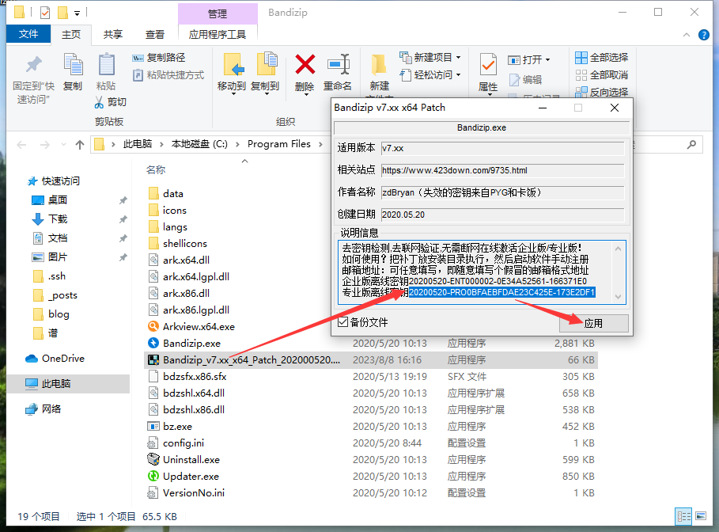
  4. **完成激活**  
打开Bandizip主程序，点击左上角的锁钥图标，邮箱随便填写，并粘贴刚才复制的密钥，点击‘注册Bandizip’  
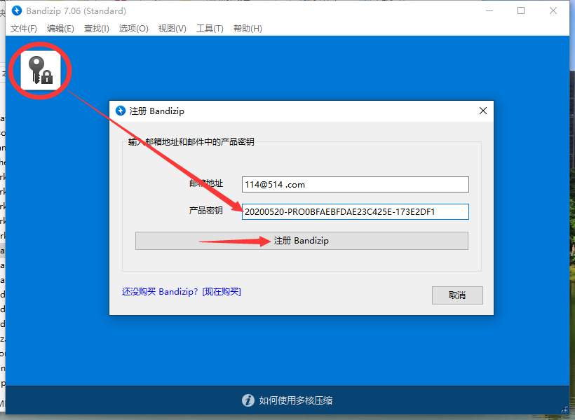  
完成激活  
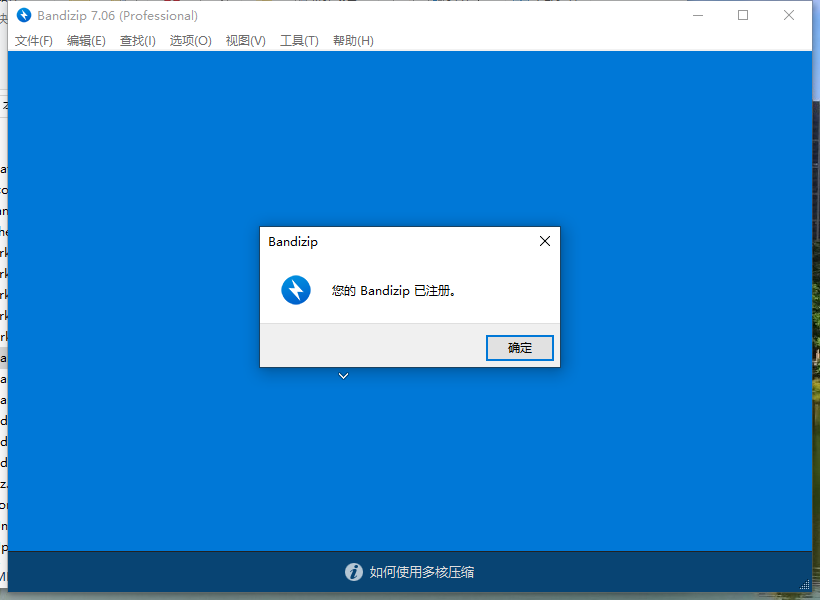
  5. **解除更新提醒**  
当我们关闭Bandizip时，会出现以下窗口  
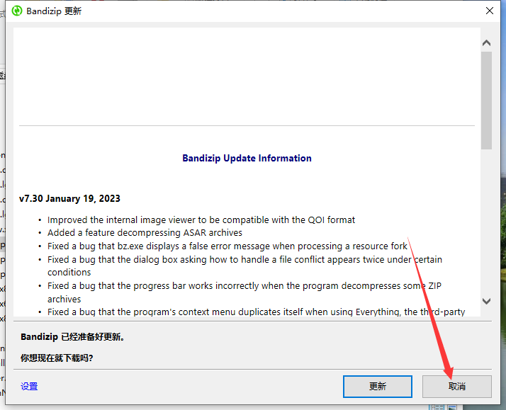  
这是因为Bandizip在退出时会自动打开更新程序，删除它即可  
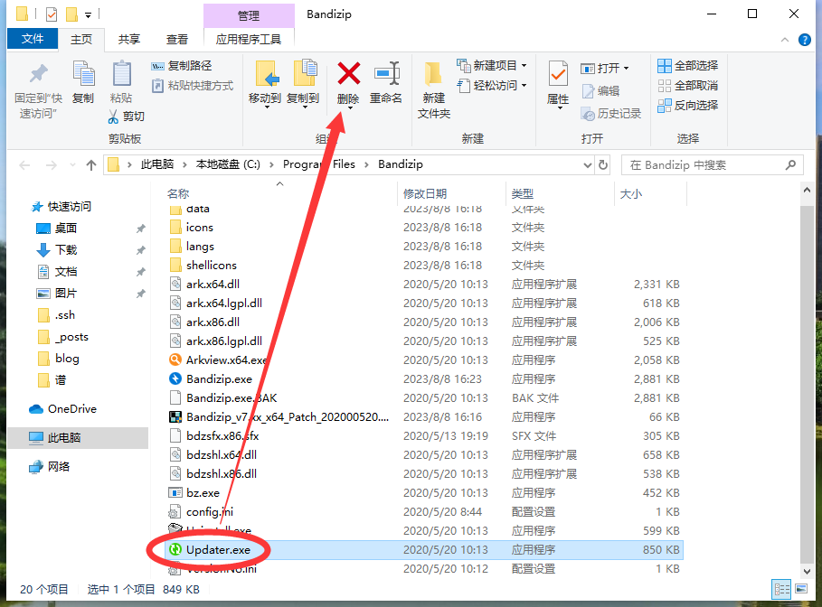
