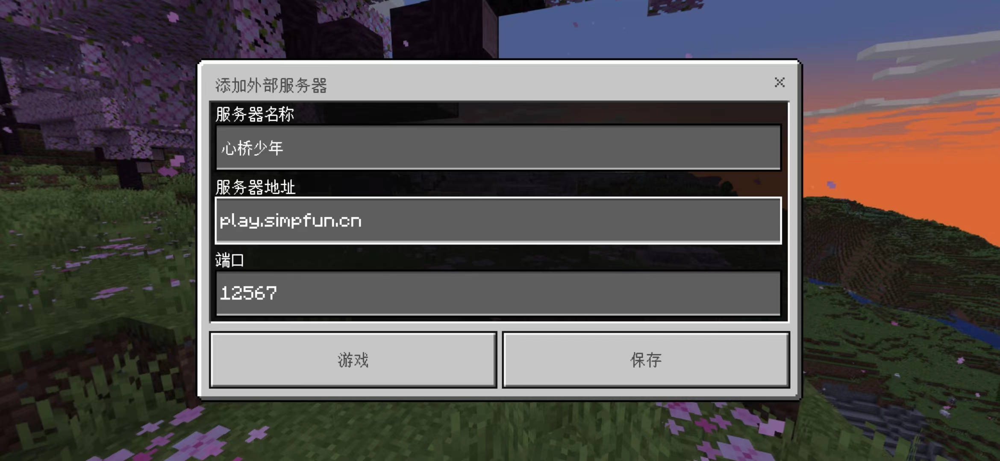
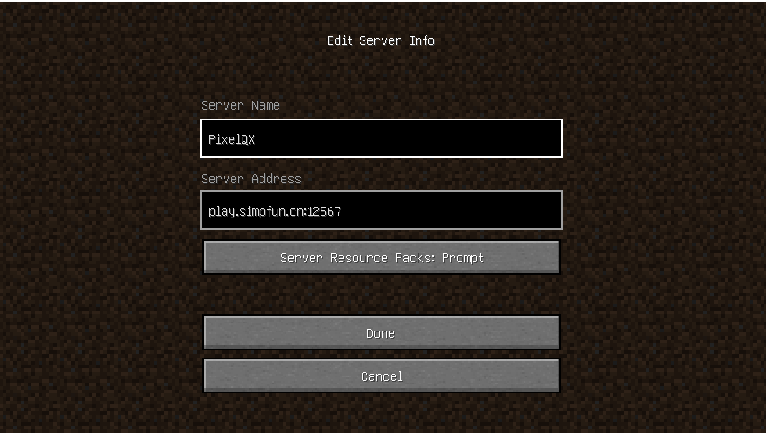
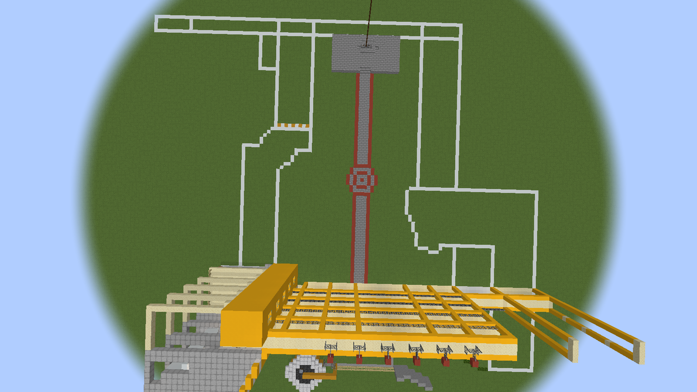
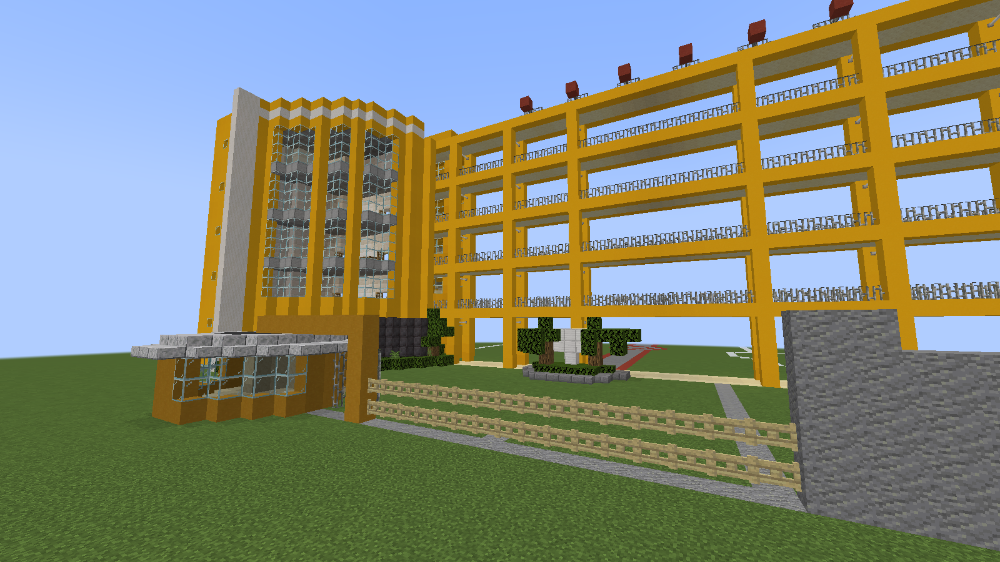
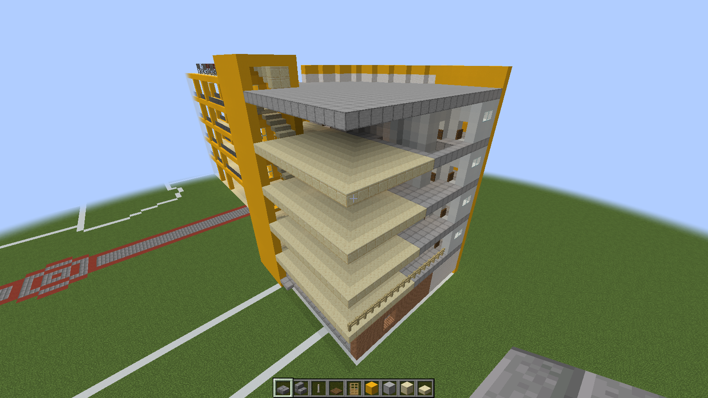
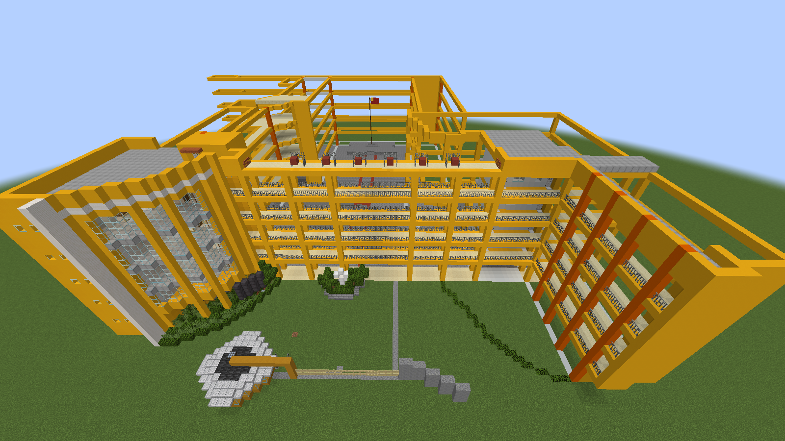
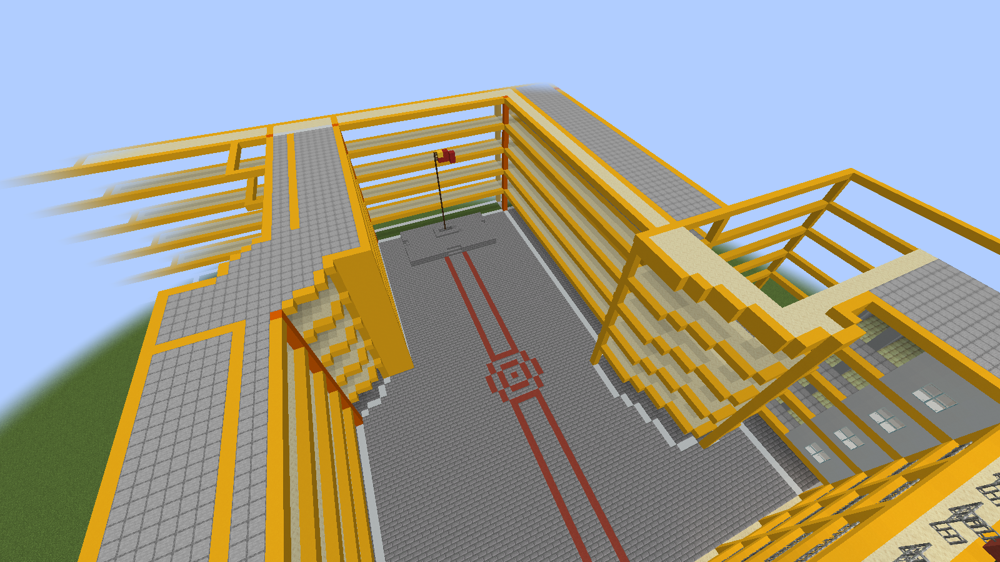
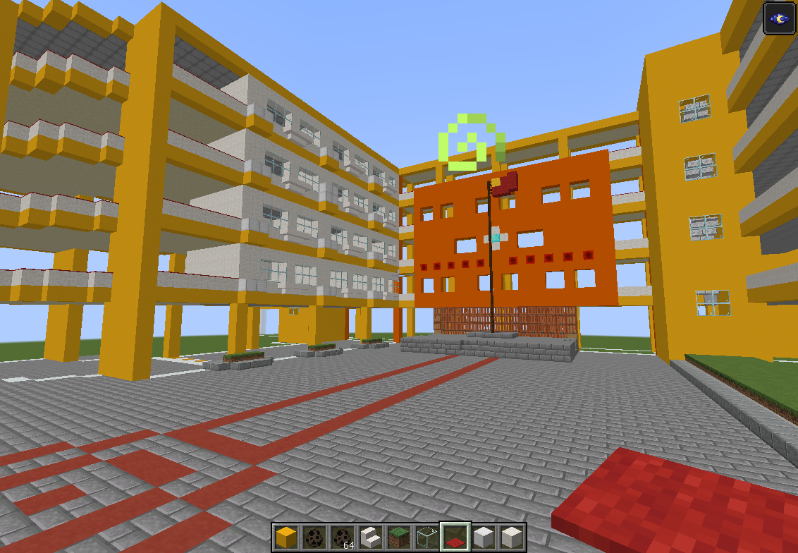
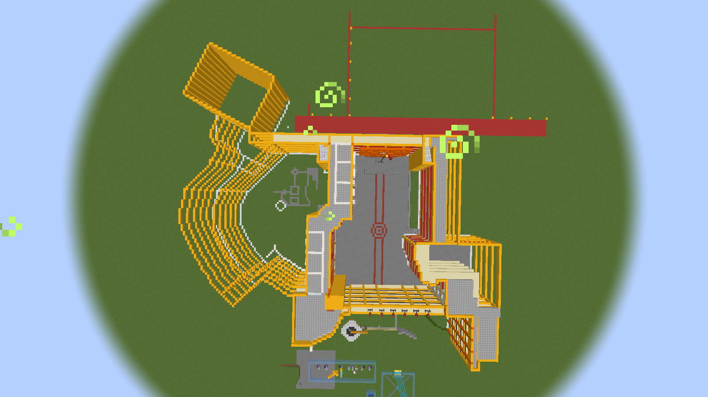
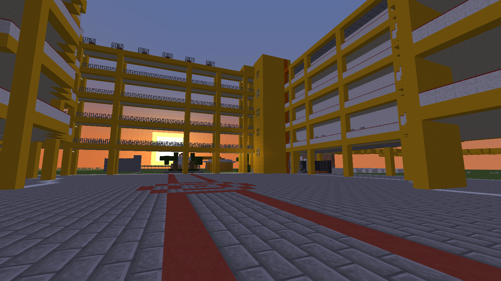

time: 2023.8.28
title: PixelQX：像素桥兴计划

# 前言

前段时间和朋友吹水时，偶尔提到了桥兴中学的事儿，突然灵光一闪：万一我们真的能在我的世界里面还原桥兴中学呢？

心动不如行动，于是就有了这个计划。并且，**我为此还开设了一个服务器，大家也可以随时进入参观玩耍。**  

# 如何加入此服务器？

本服务器同时支持java、基岩版minecraft并且无需正版账号，即您可以通过安卓手机或电脑加入服务器。

## 安卓手机参考步骤：

打开这个网址下载国际版我的世界1.20.1版本  
[点击跳转](<https://mcapks.net/info/MS4yMC4xMC4wMQ%3D%3D/5a7f50aa76c2e0b28b45946bdbdd0260.html>)  
接着输入服务器地址以及端口  
服务器 IP: play.simpfun.cn · 端口: 12567  
  
然后按照提示注册或登录Microsoft账号即可进入服务器。

## 当然你也可以使用java版登入

只需安装启动器（例如pcl2启动器），进入游戏，选择多人游戏，输入服务器地址以及端口即可直接进入。如图所示：  

# 施工进展及相关内容展示

2023/8/25  
完成了初一初二及行政楼的占地划线  

2023/8/26  
完成了办公室、正门前的架空层过道、保安亭、升旗台等相关外饰的设计  

2023/8/28  
将楼层划分清楚并完成了部分地板的铺设  
  
用指令把各楼层的框架整出来了，并且替换了升旗广场的地板为石砖  

2023/8/29  
加上一部分的地板。  

2023/8/30  
完成了初一初二课室的装修  

2023/9/02  
把初三教学楼、体育馆、生物园、操场的部分占地划线划了出来。  

之前建造的时候把建筑朝向建错了，刚刚顺便改了回来。  

