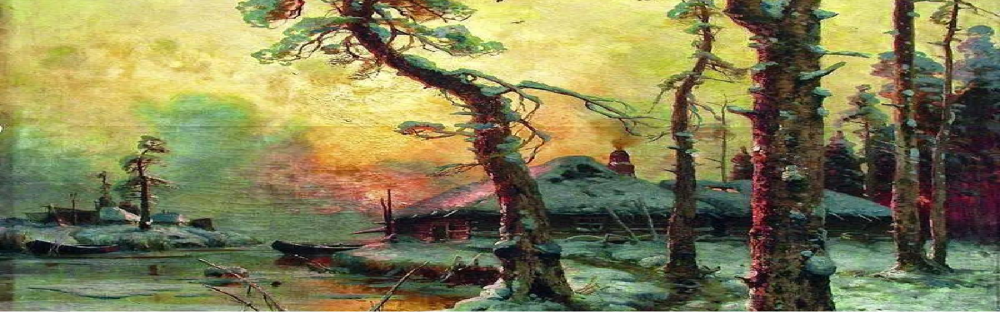
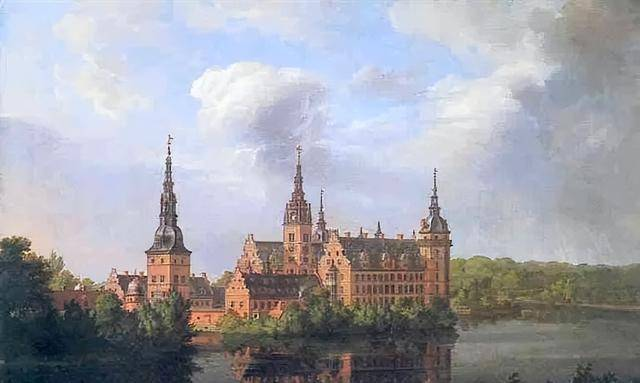
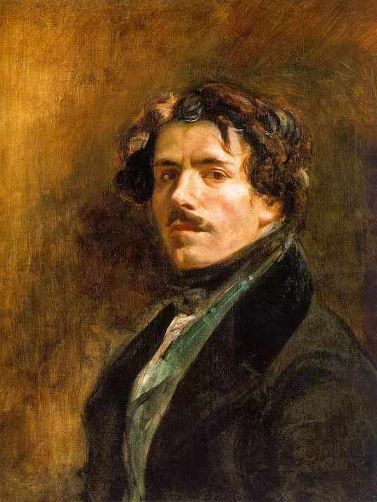
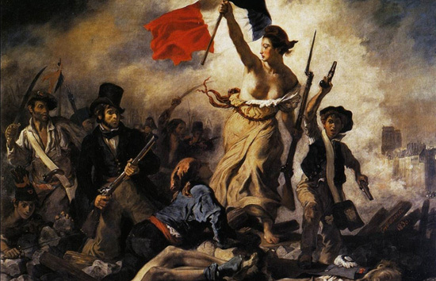
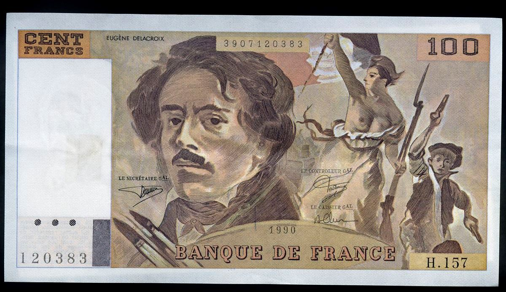

time: 2023.5.17
tag: 学习, 美术
title: 美术发言-欧洲浪漫主义

浪漫主义是兴起于18世纪后期，然后持续发展到19世纪中期的艺术运动，那么浪漫主义跟我们平时所讲的浪漫有什么关系么？ 今天，当我们提到浪漫这个词时，会很容易和热恋中的情侣产生关联，或者是在结婚纪念日当天，一个丈夫下班后，买了一束玫瑰花送给他的妻子……这些都是我们对于浪漫这个词的第一印象。而我们所说的浪漫主义跟浪漫有些不一样，浪漫是指虚构、传奇，而浪漫主义则是来源于中世纪的“传奇”一词，最早使用是在18世纪的晚期。当时人们普遍对古代的冒险离奇事件感兴趣，后来，人们就把那些同传奇故事、离奇遭遇、想象色彩相关联的事统统成为浪漫主义。

十八世纪末至十九世纪初的欧洲各国，工业的发展一路高歌猛进。正是在工 业革命的推动下使得当时欧洲及北美地区的生产力水平提升到了空前的高度，自 给自足的小农经济在欧洲大陆逐渐解体，进而迈入了工业化时代。也正是由于工 业革命，落后的生产方式和封建专制的社会结构已经成为时代的绊脚石，使得上 升的资产阶级与没落的封建贵族进行着激烈的反复的权力斗争。新兴的城市资产 阶级标榜的“自由”、“平等”、“博爱”，都成为击垮陈旧封建文化秩序的有力武器。18 世纪末发生的法国大革命彻底瓦解了欧洲传统的政治统治，随之，在德国、 英国、法国以至全欧洲，出现了一股强大的思潮——浪漫主义。它像一位人们在 精神迷惑和惶恐中期盼的神袛走遍全欧，把一种尖锐而又含混的精神气质带到人 们的心中。

现在介绍的是欧仁·德拉克罗瓦，法国著名画家。他是浪漫主义画派的典型代表。他继承和发展了文艺复兴以来欧洲各艺术流派，包括威尼斯画派、荷兰画派、彼得·保罗·鲁本斯和约翰·康斯特布尔等艺术家的成就和传统，并影响了以后的艺术家，特别是印象主义画家。他的主要作品有《十字军占领君士坦丁堡》《希奥岛的屠杀》《但丁之舟》等。

该画取材于真实的历史事件，表现如火如荼的革命场景，包括其中有原型的历史人物开象以及作者自身的参与，都表现了这幅画高度的现实意义。但这幅画被称作德拉克洛瓦浪漫主义风格的代表作，则是因为这幅画中的场景是颇为集中的浪漫主义场景，其中的自由女神更是具备“半人半神气质的一个理想化人物”。她长着古希雕塑般的轮廓，露上身，穿着朴索古典的衣着，走在革命队伍的前面，右手高举：三色旗。脸朝向人群，似在号召着人们革命到底。这样就能获得自由。与周围身穿现代服装的男士们相比，她更像一个抽象的人，代表着最高的精神与意义。她健康、有力、坚决、美丽朴素，领导着工人、知识分子的革命队伍奋勇前进，寄托了国家的革命感情和对英雄气概的向往。恰如其分地表现了现代社会最核心的政治主题：自由与民主。这幅画取材自1815年拿破仑下台后，逃亡国外的路易十八重返法国当国王，这就是“波旁王朝”第二次复辟，封建势力重新猖獗。1830年7月，路易十八的继承人查理十世企图进一步增强皇权，限制人民的选举权和出版自由并宣布解散议会。1830年7月26日，巴黎市民闻讯纷纷起义。他们拿起武器，走向街垒，为推翻这个复辟的波旁王朝浴血奋战，27至29日为推翻波旁王朝，与保皇党展开了战斗，最后占领了王宫，查理十世逃亡英国。在历史上称为“光荣的三天”。在这次战斗中，一位名叫克拉拉·莱辛的姑娘首先在街垒上举起了象征法兰西共和制的三色旗；少年阿莱尔把这面旗帜插到巴黎圣母院旁的一座桥头时，中弹倒下。画家德拉克洛瓦目击了这一悲壮激烈景象，又义愤填膺，决心为之画一幅画作为永久的纪念。

《自由引导人民》是画家在上百幅“七月革命”街战的草图的基础上定稿的画面，全画采取顶天立地的构图形式。倒在地上的尸体、战斗的勇士以及高举法兰西旗帜的女子，构成一个稳定又蕴藏动势的三角形。象征自由、平等、博爱的三色旗位于等腰三角形的顶点，自由女神的人群的头部的横竖黄金分割线的位置，场面宏伟，构图组织井然有序。他们身后都是一往无前的战士，远处的建筑是巴黎市中心的标志——巴黎圣母院。以一个象征自由的女神形象为主体，德拉克洛瓦的浪漫气质造就了这样一位袒胸露怀的女子形象，招呼着后方的人民，将神话中的自由女神与浴血奋战的人民安排到一起，她长着希腊雕塑般的轮廓，穿着朴素古典的衣着，与周围身穿现代服装的男士们相比，她更像一个抽象的人，代表着最高的精神与意义。紧跟她前后左右的是工人、市民、孩子、学生等。她的右方是一个持着双枪的少年，急速向前奔跑，表现了为了自由全民参战的的情景,他象征少年英雄阿莱尔。一名受了重伤的青年工人正抬头仰望自由女神的三色旗，前景右侧有两名政府军的士兵倒毙在地上，左侧躺着一位为自由而献身的起义者。他们手持武器，踏着血迹和尸体奋勇前进。她的身后有两个工人挥舞着尖刀，表情刚毅，显示出愤怒的神色。人群上方则是阴霾的天空。画面中一名头戴高礼帽、身穿燕尾服、手中紧握长枪的人，大声疾呼，号召人民以伟大的过去为榜样，起来进行斗争，进行革命。德拉克洛瓦在创作该幅油画时，用法兰西共和国国旗的红、白、蓝三色作为这幅画的主色， [1] 画面中描绘的自由女神高举三色旗，左手拿枪，赤着脚，正领导着人民迎风前进，明确的主题表现出女性坚强、 勇敢的一面。在弥漫着浓浓硝烟的背景中，低纯度的人物刻画突出了两面中心的女神形象，红色的旗帜更是显得格外醒目，强烈的色彩对比使画面热情奔放，给人十足的力量感。

“自由引导人民”，是一个让人心旷神怡的概念。它代表着自由的力量，能够激发人们内心最深处的梦想和期望。通过自由的引导，人们可以展现出更多的创造力和潜能，获得更多的成就感和自豪感。而这一切，都离不开人民的支持和合作。让我们共同努力，实现自由引导人民的伟大梦想！

附件：  
[欧洲浪漫主义PPT（附讲稿）](<https://yhsome.github.io/image/2023-5-18/PPT.pptx> "download")
