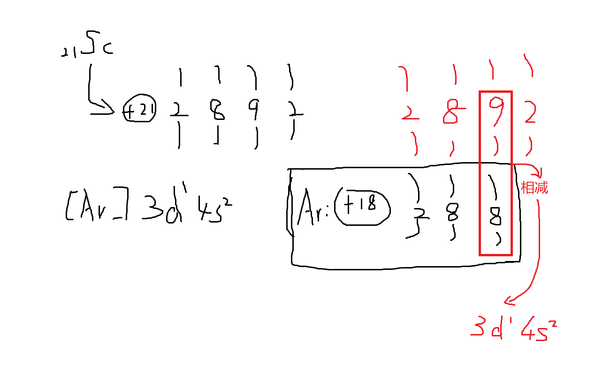
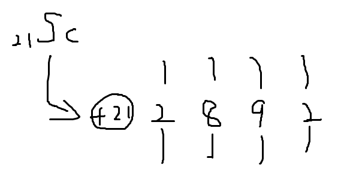
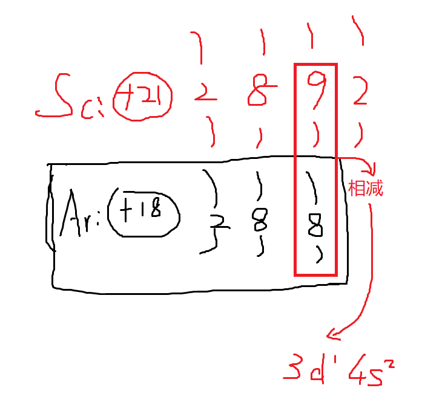
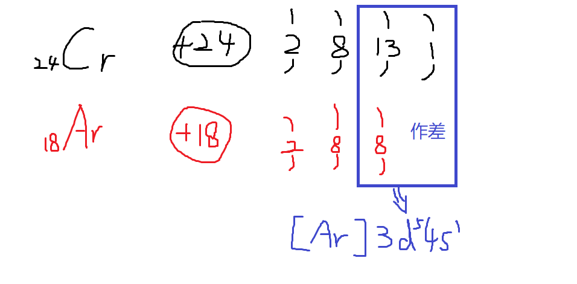

time: 2023.12.19
tag: 学习
title: 笔记-快速写简化电子排布式

## 前言

刚学选修二化学，电子排布式写得我快吐血了。两页作业做了我一个多小时。刚刚看网课时，灵光乍现，悟到了一个快速写简化电子排布式的办法。且听我娓娓道来。  

## 正文

这里以`钪(Sc)`为例，叙述其办法。  
首先，先写出它的核外电子排布图：  
（注意，这里使用了**能级交错** 知识）  
  
接着，把离他最近的上一级稀有气体核外电子排布图也写出来。  
**两式一减，即得价层电子排布式。**  
  
加上`[Ar]`即为钪的电子排布式。  
  
对于特殊的`铬(Cr)`和`铜(Cu)`也可以用同样的方法解决  

