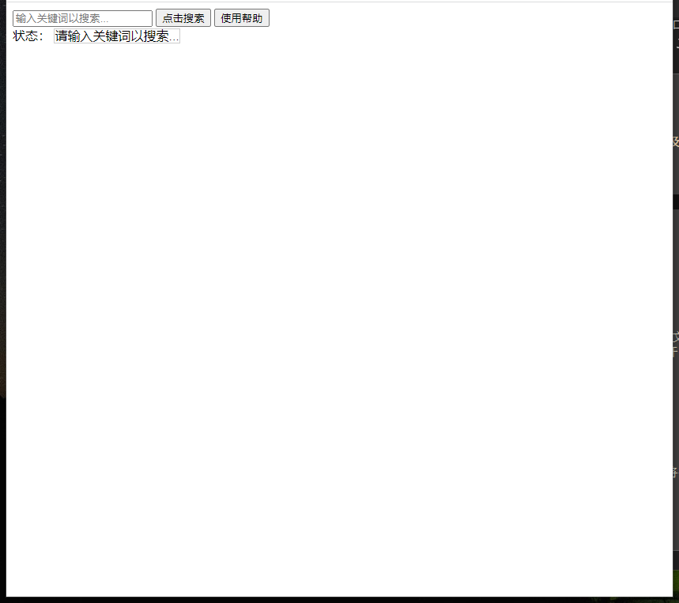
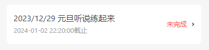
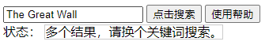
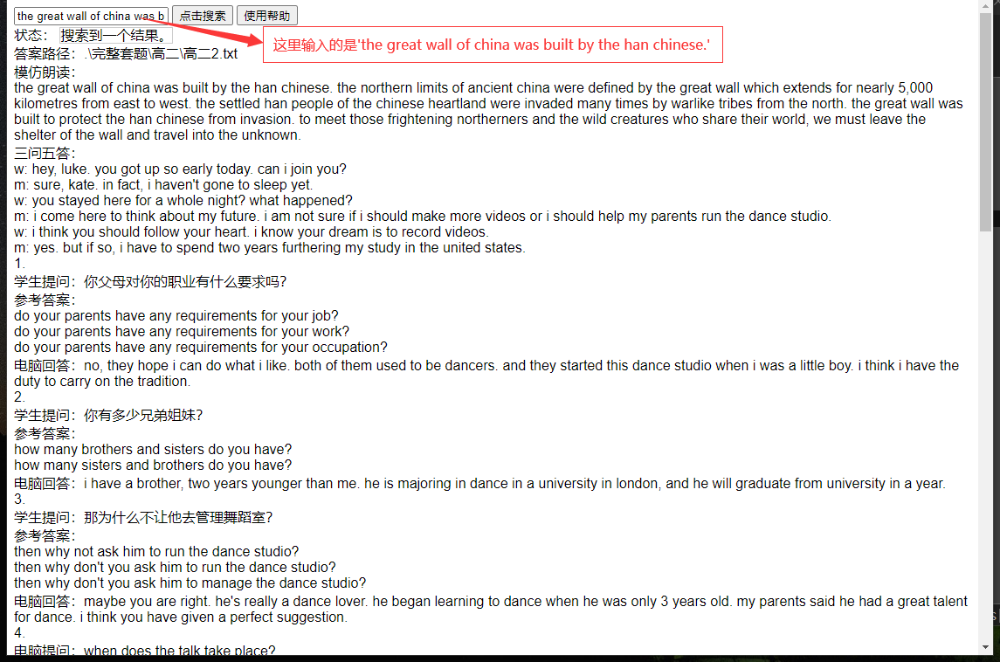

# 西柚搜索工具

 返回 [网页版西柚搜索工具](https://yhsome.github.io/xiyou)

本文档由两个部分组成：**网页版使用说明**以及**离线版安装及说明**，你可以根据副标题快速索引。

## 网页版使用教程

**西柚网页版离线端**<a href="./offline_web.html" download target="_blank">点击下载</a>

以下是教程：

首先，当我们打开这个网页时，它是这样的

虽然是空白一片，但是不要慌，因为这个时候**还没有开始搜索**

接着，你要打开你的西柚，找到你没做的作业，点进去，我以这个作业为例：

我们的目标是找到这套试题的特征词，其中，它的每一句话，每一个信息都是特征词。

例如，在模仿朗读这一节里面，视频里的每一句话都是特征词，这里以第一句话为例：

我们回去，填入关键词

似乎发生了一点意外，它告诉我们有多个结果。

其实这是因为不只有一个题目提到了这个关键词。

如果用一整句话进行搜索，也许就不会出现这种情况了。*总结：关键词（句）越长越好*

可以看见，答案已经自动出来了。

## 离线版安装及说明

西柚听说答案查询

---

指令列表：

`req [关键词]`：在当前目录及其子目录中搜索含有指定关键词的文本文件，并显示匹配文件的路径。

`get [文件路径]`：打开指定的文本文件，如果传入"-"，则会打开使用req命令找到的文件。

`clear`：清空命令行屏幕。

`help`：显示可用的命令及其说明。

`exit`：退出程序。

---

如何使用：

输入指令及参数，并按下回车执行。例如，输入 `req example` 将搜索所有含有 `example` 关键词的文件路径并显示在屏幕上。

输入 `get -` 将会打开使用 `req` 命令找到的文件。

输入 `clear` 将清空命令行屏幕。

输入 `help` 或 `?` 将会显示可用指令列表。

输入 `exit` 将退出程序。

---

注意事项

目前仅支持单个英语词汇搜索。

在使用 `get` 命令时，请确保提供正确的文件路径。可以使用 `req `命令找到文件路径和正确使用方法。

此搜索程序未提供模仿朗读以及三问专项的答案

本程序立项于2023/11/18，初版完成于2023/12/10，仅供学习，禁止商用。

---

**安装链接：**[点击下载](./offline.exe)

---

免责声明

本网站仅供用户进行HTML交流学习，所提供的信息、资料和内容仅供用户参考，并不保证其准确性、完整性或适用性。用户在进行使用时，应当自行承担全部风险和责任，包括但不限于因使用本网站而产生的任何损失、损害或额外费用。

本网站所提供的信息、资料和内容可能存在不准确、不完整或过时的情况，我们不承担任何更新或通知的责任。本网站的内容也可能随时发生变化，我们不承担任何通知或更新的责任。

对于任何第三方提供的信息、资料和内容，我们也不承担任何责任。用户在使用本网站时，应当自行判断第三方内容的可靠性和合法性。

**用户应当明确，本网站仅限于HTML交流学习，不得用于其他用途，包括但不限于进行作业查询并依据所获得的答案完成作业。对于任何违反此规定的行为，我们不承担任何责任，也不承担因用户的非法行为而产生的任何法律责任。**

本免责声明仅适用于本网站，不适用于任何其他网站或平台。用户在使用其他网站或平台时，应当自行了解相关规定和条款。

请用户在使用本网站时谨慎对待所获取的信息、资料和内容，如有任何疑问或疑虑，建议咨询专业人士或权威机构。